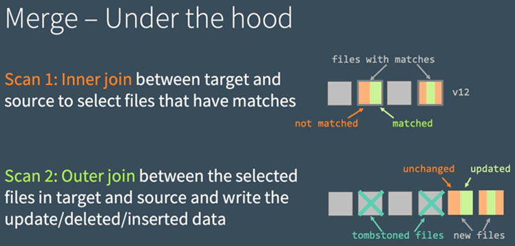

# Chapter 2 Merge

What is `MERGE`?
- Data Modification Language (DML) command that applies all three standard data manipulation language operations (INSERT, UPDATE, and DELETE) in a single transaction. 

Why merge?
- atomicity
- simplifying application logic by pushing merge logic to Delta

When merge? `apply selective changes without rewriting entire table`
1. Slowly Changing Dimension
2. Change data capture: apply change sets from other data sources
3. INSERT, UPDATE, or DELETE data with dynamic matching conditions
4. GDPR, CCPA compliance

```sql
MERGE INTO events
USING updates
    ON events.eventId = updates.eventId
    WHEN MATCHED THEN UPDATE
        SET events.data = updates.data
    WHEN NOT MATCHED THEN
        INSERT (date, eventId, data) VALUES (date, eventId, data)

-- GDPR deleting data
MERGE INTO users
USING opted_out_users
ON opted_out_users.userId = users.userId
WHEN MATCHED THEN DELETE

-- apply db change data capture
MERGE INTO users
USING (
    SELECT userId, latest.address AS address, latest.deleted AS deleted
    FROM (
        SELECT userId, MAX(struct(TIME, address, deleted)) AS latest
        FROM changes
        GROUP BY userId
    )
) latestChange
ON latestChange.userId = users.userId
WHEN MATCHED AND latestChange.deleted = TRUE 
    THEN DELETE
WHEN MATCHED 
    THEN UPDATE SET address = latestChange.address
WHEN NOT MATCHED AND latestChange.deleted = FALSE THEN
    INSERT (userId, address) VALUES (userId, address)
-- what about when not matched and latestChange.deleted = true?
```

```python 
merge_conditions = """
    target.key1 = source.key1
    and target.key2 = source.key2 
    and target.record_status = 1
"""

(
    delta_table
        .alias("target")
        .merge(change_df.alias("source"), merge_conditions)
        .whenMatchedUpdateAll()
        .whenNotMatchedInsertAll()
        .execute()
)
```

### WHEN NOT MATCHED BY SOURCE

> Use the WHEN NOT MATCHED BY SOURCE clause to UPDATE or DELETE records in the target table that do not have corresponding records in the source table.
> 
> WHEN NOT MATCHED BY SOURCE clauses are supported 
> - by the Scala, Python and Java Delta Lake APIs in `Delta 2.3 and above`. 
> - SQL is supported in Delta 2.4 and above.


add conditions to WHEN NOT MATCHED BY SOURCE and specify values to update in unmatched target rows
```sql
MERGE INTO target
    USING source
    ON source.key = target.key
    WHEN MATCHED THEN
        UPDATE SET target.lastSeen = source.timestamp
    WHEN NOT MATCHED THEN
        INSERT (key, lastSeen, status) VALUES (source.key,  source.timestamp, 'active')
    WHEN NOT MATCHED BY SOURCE AND target.lastSeen >= (current_date() - INTERVAL '5' DAY) THEN
UPDATE SET target.status = 'inactive'
```

```python
(targetDF
    .merge(sourceDF, "source.key = target.key")
    .whenMatchedUpdate(
        set = {"target.lastSeen": "source.timestamp"}
    )
    .whenNotMatchedInsert(
        values = {
            "target.key": "source.key",
            "target.lastSeen": "source.timestamp",
            "target.status": "'active'"
        }
    )
    .whenNotMatchedBySourceUpdate(
        condition="target.lastSeen >= (current_date() - INTERVAL '5' DAY)",
    )
    .execute()
)
```

### scd2

```python
customersTable = ...  # DeltaTable with schema (customerId, address, current, effectiveDate, endDate)

updatesDF = ...       # DataFrame with schema (customerId, address, effectiveDate)

# Rows to INSERT new addresses of existing customers
newAddressesToInsert = updatesDF \
  .alias("updates") \
  .join(customersTable.toDF().alias("customers"), "customerid") \
  .where("customers.current = true AND updates.address <> customers.address")

# Stage the update by unioning two sets of rows
# 1. Rows that will be inserted in the whenNotMatched clause
# 2. Rows that will either update the current addresses of existing customers or insert the new addresses of new customers
stagedUpdates = (
  newAddressesToInsert
  .selectExpr("NULL as mergeKey", "updates.*")   # Rows for 1
  .union(updatesDF.selectExpr("updates.customerId as mergeKey", "*"))  # Rows for 2.
)

# Apply SCD Type 2 operation using merge
customersTable
    .alias("customer")
    .merge(
        stagedUpdates.alias("staged_updates"),
        "customers.customerId = mergeKey"
    )
    .whenMatchedUpdate(
        condition = "customer.current = true AND customers.address <> staged_updates.address",
        # set current to false and endDate to source eff date
        set = {
            "current": "false",
            "endDate": "staged_updates.effectiveDate"
        }
    )
    .whenNotMatchedInsert(
        values= {
            "customerid": "staged_updates.customerId",
            "address": "staged_updates.address",
            # Set current to true along with new address and eff date
            "current": "true",
            "effectiveDate": "staged_updates.effectiveDate",
            "endDate": "null
        }
    )
    .execute()
```

### streaming

```scala
// streaming pipeline updates session info
streamingSessionUpdatesDF
    .writeStream
    .foreachBatch { (microBatchOutputDF: DataFrame, batchid: Long) => 
        microBatchOutputDF.createOrReplaceTempView("updates")
        microBatchOutputDF.sparkSession.sql(s"""
            MERGE INTO sessions
            USING updates
            ON sessions.sessionId = updates.sessionId
            WHEN MATCHED THEN UPDATE SET *
            WHEN NOT MATCHED THEN INSERT *
        """)
    }
    .start()
```

## Under the hood

Delta Lake executes merge in 2 steps
1. select all files that have matches: `change inner join target`
2. find updated/ deleted/ inserted data: `selected files above outer source`
3. write out the updates, deletes, inserts

Source: Databricks



Performance tuning: `determine which join is slow`.

Case `inner join`
1. add more predicates to narrow down search space
2. adjust shuffle partitions
3. adjust broadcast join thresholds
4. `compact` the small files in the table if there are lots of them, but `don't compact into too large files` as Delta needs to rewrite the entire file with even 1 row updated.

Case `outer join` (rewriting files)
1. tune shuffle partitions (too many small files?)
2. reduce files by enabling auto repartitioning before writes
3. adjust broadcast join thresholds
4. cache source table/ dataframe. Do not cache target table.

## References
- https://delta.io/blog/2023-02-14-delta-lake-merge/
- https://www.databricks.com/blog/2020/09/29/diving-into-delta-lake-dml-internals-update-delete-merge.html
- [Efficient Upserts into Data Lakes with Databricks Delta](https://www.databricks.com/blog/2019/03/19/efficient-upserts-into-data-lakes-databricks-delta.html)
- [Table deletes, updates, and merges. Delta Lake doc.](https://docs.delta.io/latest/delta-update.html)